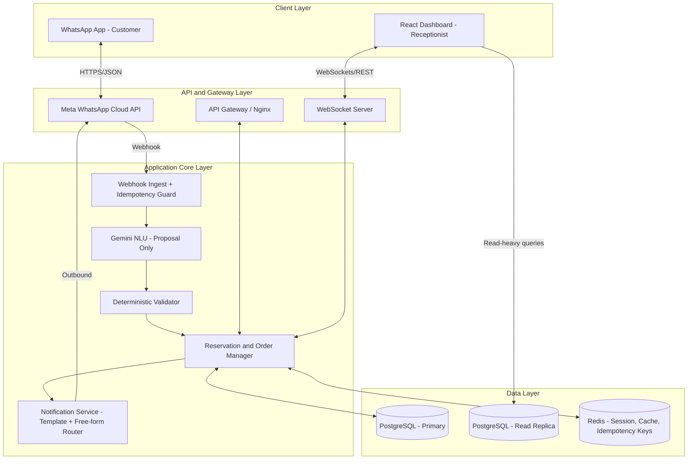
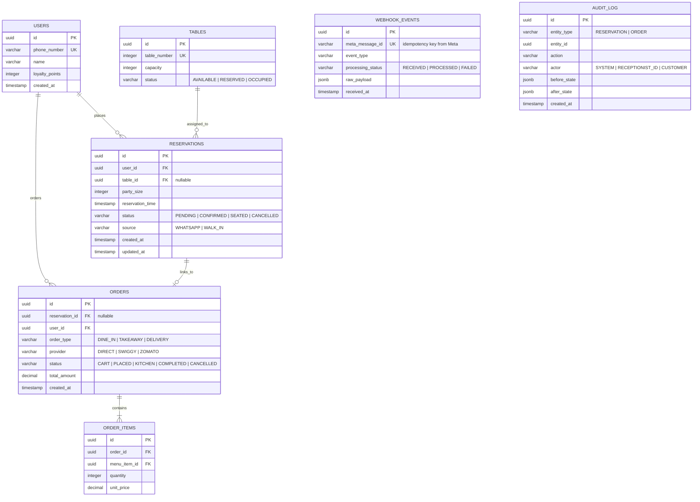

# System Architecture
## WhatsApp AI Ordering & Reservation System — v2 (Reliability-Reviewed)

**Status:** Draft v2 — supersedes `architecture_and_ui.md` v1
**Changes from v1:** Adds idempotency handling, AI guardrails, WhatsApp session-window handling, and failure-mode design. UI content moved to `ui-design.md`. Security content moved to `security.md`.

---

## 1. What Changed From v1 and Why

| v1 Gap | Why It's a Real Problem | Fix in v2 |
|---|---|---|
| No idempotency on webhooks | Meta's Cloud API redelivers webhooks on timeout/non-200 response — without dedup, a slow server response causes duplicate orders/reservations | Section 4 — idempotency key on every inbound webhook |
| AI in the direct write path with no fallback | LLMs can misparse "tonight" (ambiguous date), invent menu items, or misread party size from casual phrasing | Section 5 — AI proposes, deterministic layer validates before any DB write |
| No handling of WhatsApp's 24-hour session window | Free-form AI messages only work within 24h of the customer's last message; outside that, only pre-approved template messages are allowed | Section 6 — explicit session-state tracking and template fallback |
| Single DB/cache instance implied, no failure mode | "Reliable" requires stating what happens when Postgres, Redis, or Gemini's API is down or slow | Section 7 — degradation behavior per dependency |
| No observability | Can't debug a wrong order or a missed reservation without logs/tracing | Section 8 |

---

## 2. High-Level Architecture



### Tech Stack

| Layer | Choice | Notes |
|---|---|---|
| Backend API | Node.js (TypeScript), NestJS | Good fit for structured module boundaries (webhook ingest, AI, validator, order manager as separate modules) |
| Frontend Dashboard | React (Vite) | As v1 |
| Database | PostgreSQL, primary + read replica | Replica added so dashboard read-heavy queries (queue list, floor map refresh) don't contend with write-path (reservation/order inserts) |
| Session & Cache | Redis | Also stores idempotency keys (Section 4) and WhatsApp session-window state (Section 6) |
| AI Engine | Google Gemini SDK | Used for parsing/recommendation *proposals* only — never writes directly (Section 5) |
| Real-time | Socket.io | As v1 |
| Queue (new) | A lightweight job queue (BullMQ on Redis, or equivalent) | For outbound WhatsApp notification retries — outbound Meta API calls can fail/rate-limit and need retry-with-backoff, not a fire-and-forget call |

**Note on "reliable":** reliability isn't a single component, it's what the system does at each failure point. Section 7 covers this explicitly — don't treat this stack list as sufficient on its own.

---

## 3. Database Schema

Same core entities as v1, with two additions: an idempotency ledger and an audit log.



**Why `WEBHOOK_EVENTS` exists:** Meta's Cloud API guarantees at-least-once delivery, not exactly-once. Without a dedup table keyed on `meta_message_id`, a retried webhook (which Meta sends automatically if your server doesn't respond 200 within its timeout window) creates a second reservation or a duplicate order line. This table is the fix — check-then-insert on `meta_message_id` before any processing.

**Why `AUDIT_LOG` exists:** When a receptionist edits a table assignment and the customer says "I never agreed to that," or a duplicate charge happens, you need a before/after trail. This is also a practical requirement under DPDP Act accountability principles — see `security.md`.

---

## 4. Webhook Idempotency (New in v2)

```
1. Meta sends webhook → arrives at WH (Webhook Ingest)
2. WH checks: does meta_message_id already exist in WEBHOOK_EVENTS?
     → YES: return 200 immediately, do nothing further (already processed or in-flight)
     → NO: insert row with processing_status=RECEIVED, proceed
3. Process event (AI parse → validate → write)
4. Update processing_status=PROCESSED (or FAILED with reason)
5. Always return HTTP 200 to Meta within its timeout window, even if internal processing is deferred to a queue —
   acknowledge receipt fast, process asynchronously
```

**Concrete failure this prevents:** customer messages "book a table for 4 tonight at 8," your server takes 12 seconds to respond (AI call + DB write), Meta's webhook times out and retries the same message — without this guard, you get two PENDING reservations for the same request.

---

## 5. AI Layer — Proposal, Not Authority (New in v2)

v1 had Gemini sitting directly in the write path (`RO <--> AI` writing to `DB`). This is the single highest-risk design choice in v1 for a booking/ordering system, because:

- LLMs can misresolve relative dates ("tonight," "tomorrow lunch") without an explicit timezone-aware anchor
- LLMs can hallucinate a menu item that sounds plausible but doesn't exist in the current menu
- LLMs are non-deterministic — the same input can occasionally produce different structured output

**v2 pattern:**

```
Customer message
      │
      ▼
Gemini NLU → produces a STRUCTURED PROPOSAL (not a DB write)
   e.g. { intent: "RESERVE", party_size: 4, date: "2026-08-02", time: "20:00", confidence: 0.91 }
      │
      ▼
Deterministic Validator (plain code, not AI):
   - party_size is a positive integer within restaurant's max
   - date/time resolves to a real, bookable future slot
   - if intent is ORDER: every referenced menu_item_id exists AND is currently in stock
   - if confidence < threshold OR any check fails → do NOT write; ask a clarifying question instead
      │
      ▼
Only validated, confidence-passed proposals reach the Reservation/Order Manager for a DB write
```

**Rule:** the AI layer is never the last step before a database write. A deterministic validator always sits between AI output and persistence.

---

## 6. WhatsApp 24-Hour Session Window (New in v2)

This was flagged as an open question in the PRD and needs to be resolved architecturally, not just noted.

WhatsApp Business API (via Meta Cloud API) only allows **free-form messages** within 24 hours of the customer's last inbound message. Outside that window, only **pre-approved message templates** can be sent.

**Implication for this system:**
- A same-session conversation (customer books, AI chats, confirms) — free-form works fine
- A receptionist edit made *after* the customer has gone quiet for >24h (e.g., editing tomorrow's 8pm booking a day in advance) — the confirmation/edit notification **must go out as a pre-approved template message**, not free-form AI text

**Design requirement:**
- `KV` (Redis) tracks `last_inbound_message_at` per user
- `Notification Service` checks this before sending: if `now - last_inbound_message_at < 24h` → free-form allowed; else → route through a pre-approved template (e.g., "Your reservation for {{date}} at {{time}}, Table {{table}}, has been updated. Reply to this message with any questions.")
- Templates must be submitted to Meta for approval in advance — this has a lead time (typically 24-48h for review) and needs to be budgeted into the project timeline, not assumed available on day one

---

## 7. Failure Modes & Degradation Behavior (New in v2)

"Reliable" means defining what happens when a dependency fails — not assuming it won't.

| Dependency Down/Slow | System Behavior |
|---|---|
| Gemini API timeout or error | Fall back to structured button/list flow (no free-text parsing) rather than failing the whole conversation — the WhatsApp flow states in Section 5 of the original doc work without AI; AI is an enhancement layer, not a hard dependency |
| PostgreSQL primary unavailable | Writes fail loudly (return error to customer: "We're experiencing an issue, please try again in a moment" — do NOT silently drop the request); reads can fall back to replica in read-only mode for dashboard viewing |
| Redis unavailable | Idempotency checks cannot run — safer to reject/delay processing new webhooks briefly than to risk duplicate writes; session-window checks default to "assume template required" (safe default, avoids violating WhatsApp policy) |
| Meta WhatsApp API down | Outbound notification queue (BullMQ) retries with exponential backoff; dashboard still functions for staff to manage floor/orders manually in the meantime |
| WebSocket connection drops (dashboard) | Dashboard falls back to polling `GET /api/reservations/queue` every N seconds until reconnect — receptionist should never lose visibility into the queue silently |

---

## 8. Observability (New in v2)

Minimum viable observability for a system moving money and managing physical table state:

- **Structured logging** on every webhook received, every AI proposal generated, every validator pass/fail, every DB write — correlated by a single `trace_id` per customer interaction
- **Alerting** on: webhook processing failures exceeding a threshold, AI confidence scores trending low (signals menu/prompt drift), outbound notification queue depth growing (signals Meta API issues)
- Audit log (Section 3) doubles as a debugging tool for "what happened to this specific reservation"

---

## 9. Real-Time Events & REST APIs

Unchanged from v1, included here for completeness.

### WebSocket Events
1. `booking.created` (Server → Client)
2. `booking.updated` (bidirectional)
3. `booking.confirmed` (Client → Server, triggers outbound WhatsApp via Notification Service)

### REST APIs
- `GET /api/reservations/queue`
- `POST /api/reservations/walk-in`
- `PUT /api/reservations/:id`
- `PATCH /api/reservations/:id/confirm`

All endpoints require authentication — see `security.md` Section 3 for the auth model, which was entirely absent from v1.

---

## 10. Open Decisions Carried Forward

- Table ID canonical method (manual vs QR) — still unresolved from PRD, needs to be settled before Section 5's validator can enforce it
- WhatsApp Business Solution Provider (direct Meta Cloud API vs Twilio/Gupshup) — affects template approval workflow and cost, not yet decided
- Payment gateway — not yet decided (see `security.md` for what this affects re: PCI scope)
