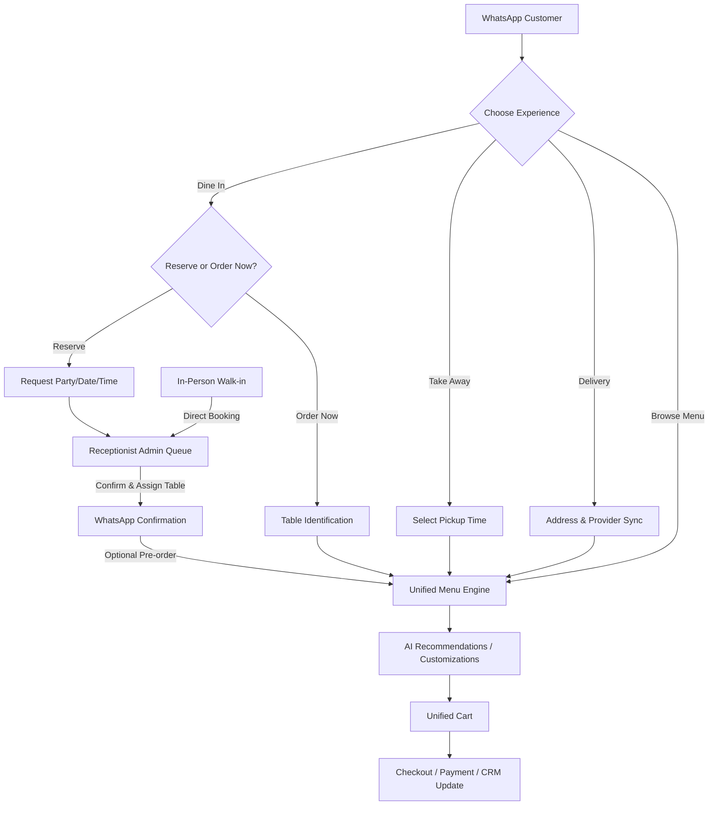

# Analysis & Understanding: WhatsApp AI Ordering System

This document outlines the core specifications, architecture, and open decisions found in the project's documentation: [PRD.md](file:///E:/webstack/wp_automation/PRD.md) and [whatsapp-ordering-ideation.md](file:///E:/webstack/wp_automation/whatsapp-ordering-ideation.md).

---

## 1. Core Principle: Unified Ordering Engine
A foundational constraint of the system is: **One ordering engine, multiple entry points.**
Regardless of whether a user starts by dining in, ordering takeaway, getting delivery, or simply browsing, the downstream sequence remains unified:
```
Menu ➔ Category ➔ Items ➔ Variants ➔ Add-ons ➔ Cart ➔ Review ➔ Confirm
```
The ordering engine is parameterized by the `orderType` and its associated context, ensuring there is no duplication of cart, menu, or checkout logic.

---

## 2. User Entry Paths

The system handles four primary entry paths, converging on the shared ordering engine:



### Detailed Path Breakdown:

1. **Dine In**
   - **Reserve a Table (Queue-Based Approval & Updates):** Customer selects date, time, and party size via WhatsApp, entering the **Pending Reservation Queue** in the Receptionist Admin Panel. Once confirmed/assigned by the receptionist, the customer is notified on WhatsApp and prompted to optionally pre-order.
   - **Queue Editing & Synchronization:** The receptionist has full edit rights over any queue item or confirmed reservation (e.g., adjust party size, time, name, phone, or table). If a WhatsApp-linked booking is modified, the system automatically sends a WhatsApp update message to keep the customer in sync.
   - **In-Person Walk-ins:** The receptionist can directly register, assign tables, and edit details for guests standing in-person, bypassing the WhatsApp queue entirely.
   - **Order Now:** Direct path for seated customers. Requires table identification (either QR or manual).
2. **Take Away**
   - Streamlined: `Menu` ➔ `AI Recommendation` ➔ `Cart` ➔ `Pickup Time Selection` ➔ `Payment` ➔ `Ready Notification`.
3. **Delivery**
   - Selection of address, serviceability checks, and delivery provider (Restaurant Direct, Swiggy, or Zomato) must happen **before** loading the menu, as prices/items differ per provider.
4. **Browse Menu**
   - Allows users to explore the menu without setting an `orderType` immediately. The `orderType` is resolved at checkout (e.g. `orderType: "BROWSING"` or `null` transitioning to a resolved type).

---

## 3. Conversational AI Layer

The AI layer sits on top of the ordering engine to reduce browsing friction:
- **Natural Language Search:** E.g., *"Something spicy under ₹500"* maps tags and prices.
- **Combo/Bundle Creation:** E.g., *"Recommend something for four people"*.
- **Persistent Dietary Filters:** E.g., *"I'm vegetarian"* stores a session filter applied to all subsequent views.
- **Live Inventory Guardrail:** AI recommendations must query the *live* in-stock inventory and context-specific pricing to avoid suggesting unavailable items.

---

## 4. Backend Order Objects

The schema supports an indifferent ordering engine at the cart/menu level, using JSON representations like:

```json
// Delivery
{
  "orderType": "DELIVERY",
  "provider": "SWIGGY",
  "restaurantId": "123"
}

// Dine In
{
  "orderType": "DINE_IN",
  "table": "12"
}

// Takeaway
{
  "orderType": "TAKEAWAY"
}

// Browsing (Uncommitted)
{
  "orderType": "BROWSING"
}
```

---

## 5. Decisions & Open Questions Required Before Build

To successfully begin implementing this system, we need to resolve the following key questions:

| Decision | PRD Context & Risks | Recommended Approach |
| :--- | :--- | :--- |
| **1. Table ID Source of Truth** | QR code auto-detection vs. manual table number entry. Mixing both risks mismatches. | **QR code auto-detect** is highly recommended to reduce manual user error, with an optional manual fallback if the QR code is damaged. |
| **2. Browsing ➔ Commit Transition** | State machine for when a browsing cart converts to a specific delivery/dine-in order. | Set `orderType: "BROWSING"` initially. Intercept the checkout action, prompt for delivery/dine-in details, validate contents against that context, and transition the state. |
| **3. Delivery Menu Sync** | Swiggy/Zomato/Direct menu sync. Operational bottleneck. | Identify if an aggregator API (like UrbanPiper/Prime) is available, or establish a manual CSV/JSON upload panel to update all menu instances simultaneously. |
| **4. Session Persistence** | How long does an inactive WhatsApp session or cart persist before expiration? | Implement a 24-hour expiration aligning with the standard WhatsApp user-initiated session window. |
| **5. Payment Timing** | Is payment required for dine-in pre-orders, or collected later? | Collect payment during checkout for pre-orders, but allow post-meal billing for seated customers. |
| **6. WhatsApp Business Provider** | Choice of BSP (e.g., Twilio, Gupshup, Meta Cloud API direct). | Meta Cloud API direct offers the lowest latency and cost for high-frequency AI interactions. |
| **7. Receptionist Queue / Walk-In UI** | Interface requirements for the receptionist to manage the pending queue and register direct walk-ins. | Build a simple, real-time single-page application (SPA) dashboard or integrate with existing POS reservation management tools (if APIs exist). |

---

## 6. Project Risks & Hard Constraints

1. **WhatsApp 24-Hour Session Window:** AI back-and-forth must operate within the user-initiated window. Out-of-window messages require template approvals.
2. **Menu Desync Across Channels:** Displaying outdated pricing or unavailable items on third-party aggregators will lead to customer drop-offs.
3. **AI Accuracy:** Recommending items that are "86'd" (out of stock) must be prevented by hard-linking the AI context to the live database status.

---

## 7. Receptionist Dashboard UI Concept

Below is a design mockup for the receptionist's admin interface, illustrating how pending WhatsApp requests enter the queue and how direct walk-ins are managed:


