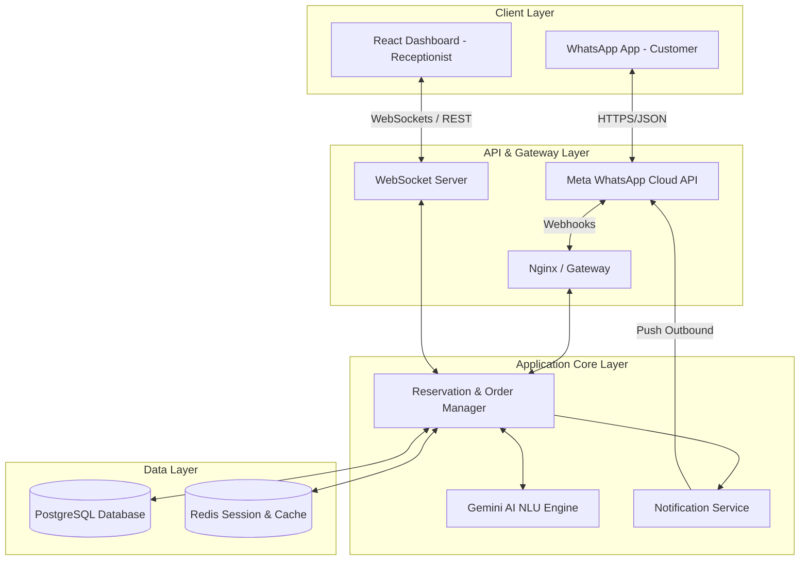
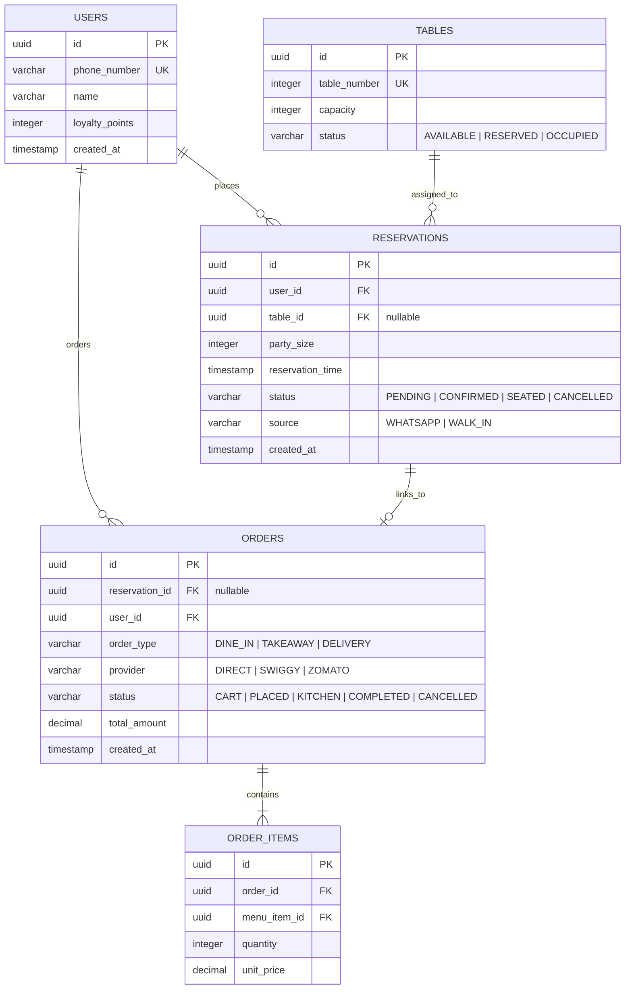

# System Architecture & UI Specification
## WhatsApp AI Ordering & Reservation System

This document outlines the software architecture, database design, integration interfaces, and user interface specifications for both the customer-facing WhatsApp bot and the receptionist dashboard.

---

## 1. System Architecture

The system uses a layered, event-driven architecture designed to process real-time incoming Webhook payloads from WhatsApp and push updates to the receptionist's dashboard via WebSockets.



### Tech Stack Recommendation
*   **Backend API Services:** Node.js (TypeScript) with Express or NestJS (ideal for high-concurrency WebSocket connections and Webhook handling).
*   **Frontend Dashboard:** React.js (Vite) with CSS Modules or Vanilla CSS.
*   **Database:** PostgreSQL (for relational table bookings, orders, and user mapping).
*   **Session & Queue State Store:** Redis (for tracking WhatsApp conversational states and temporary cart data).
*   **AI Engine:** Google Gemini SDK (for menu parsing, natural language recommendation search, and intent resolution).
*   **Real-time Communication:** Socket.io (WebSocket library).

---

## 2. Database Schema (PostgreSQL Model)



---

## 3. Real-Time Event Flows & API Specifications

### Real-Time WebSocket Events (Dashboard Connection)
1.  `booking.created` (Server ➔ Client): Broadcasts a new WhatsApp reservation request to the receptionist's dashboard.
2.  `booking.updated` (Server ➔ Client / Client ➔ Server): Sent when a reservation's details (party size, time, table) are modified either by the receptionist or customer.
3.  `booking.confirmed` (Client ➔ Server): Sent when receptionist confirms a booking and assigns a table. Emits WhatsApp notification to customer.

### Key REST APIs (Dashboard Frontend ➔ Backend Server)
*   `GET /api/reservations/queue`: Retrieves list of all pending and confirmed reservations.
*   `POST /api/reservations/walk-in`: Registers a new in-person walk-in guest (immediately sets status to `CONFIRMED`).
*   `PUT /api/reservations/:id`: Edits booking details (party size, reservation time, name, or assigned table ID). Triggers WhatsApp outbound sync.
*   `PATCH /api/reservations/:id/confirm`: Confirms a reservation and binds `table_id`.

---

## 4. UI Layout & Component Wireframes

### A. Receptionist Dashboard UI Layout
The dashboard layout is optimized for quick actions, scanning, and real-time operations.

```
+---------------------------------------------------------------------------------------+
|  Brand Logo  |  [Active Floor Map]  [Reservations Queue]  [Walk-ins]      (Profile)   |
+---------------------------------------------------------------------------------------+
|  SEARCH & FILTERS                      |  SELECTED RESERVATION DETAIL PANEL          |
|  [ Search by Name/Phone... ]           |  Name: Ratnadeep                            |
|  Status: [ All ] [ Pending ] [ Active ]|  Phone: +91 98765 43210                     |
|                                        |  Source: WhatsApp (Pending for 3 mins)       |
|  QUEUE LIST (Pending First)            |  Requested: Tonight, 8:00 PM (4 Guests)     |
|  +-----------------------------------+ |                                             |
|  | 🔔 Ratnadeep (4 Guests)           | |  TABLE ASSIGNMENT:                          |
|  |    Tonight, 8:00 PM | WhatsApp    | |  [ Select Table (Auto-suggest Table 4) v ]  |
|  +-----------------------------------+ |  Capacity: 4 Seats | Zone: Main Floor       |
|  | 👤 Rahul K. (2 Guests)            | |                                             |
|  |    Tonight, 8:30 PM | Walk-in     | |  ACTIONS:                                   |
|  +-----------------------------------+ |  +--------------------+  +---------------+  |
|  | 👤 Priya M. (6 Guests)            | |  | Confirm Booking    |  | Edit Details  |  |
|  |    Tonight, 9:00 PM | WhatsApp    | |  +--------------------+  +---------------+  |
|  +-----------------------------------+ |  | Cancel Reservation |                     |
|                                        |  +--------------------+                     |
+---------------------------------------------------------------------------------------+
```

### Component Hierarchies (React Structure)
```
DashboardApp/
├── Header/
│   ├── Navigation (Tabs: Floor Map, Queue Manager)
│   └── SystemAlerts (Real-time sound/visual ping for new WhatsApp bookings)
├── QueueManager/
│   ├── FilterBar (Search, Date Picker, Status Filter)
│   ├── QueueList (Scrollable cards displaying WhatsApp & Walk-in items)
│   │   └── QueueCard (Item details, elapsed queue timer, status badges)
│   └── DetailPanel (Deep-dive specs, table selector, and actions panel)
├── FloorMap/
│   ├── FloorZoneGrid (Visual representation of tables: Green, Yellow, Red)
│   └── TableCard (Capacity, status, guest details, checkout buttons)
└── WalkInModal/
    └── WalkInForm (Guest metadata, party size, immediate table assignment)
```

---

## 5. WhatsApp Chat Flow States

```
[State 0: Initial Contact / Menu Trigger]
  - "Hello! Welcome to [Restaurant Name]. How can we help you today?"
  - Buttons: [1. Dine In] [2. Take Away] [3. Delivery] [4. Browse Menu]

[State 1: Selection - Dine In]
  - "Awesome! Do you want to reserve a table for later, or order now at your table?"
  - Buttons: [Reserve Table] [Order Now]

[State 2: Awaiting Booking Metadata]
  - Bot asks: "How many guests will be joining us?" -> User types/clicks count.
  - Bot asks: "What date and time would you like to book for?" -> User enters details.
  - Bot: "Perfect, we are checking availability. You will get a confirmation message shortly!"

[State 3: Awaiting Approval (Server Action)]
  - User is in "QUEUE" state. Dashboard receives booking.created event.
  - Receptionist matches user request with Table X and clicks confirm.

[State 4: Booking Confirmed (Alert Triggered)]
  - WhatsApp Push: "🎉 Good news! Your booking is confirmed on Table X for [Time]. Would you like to pre-order food to save time?"
  - Buttons: [Yes, Pre-order] [No, Thanks]
```
