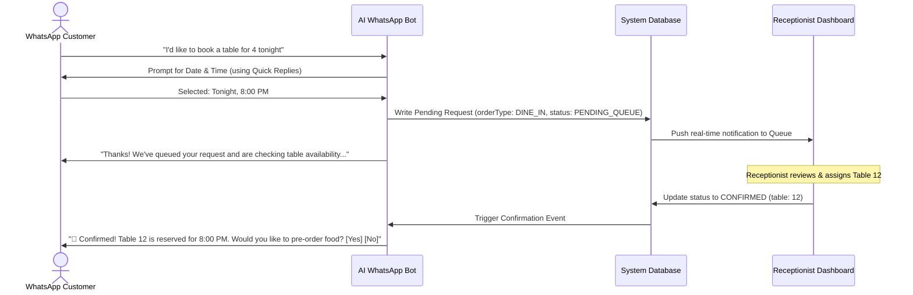
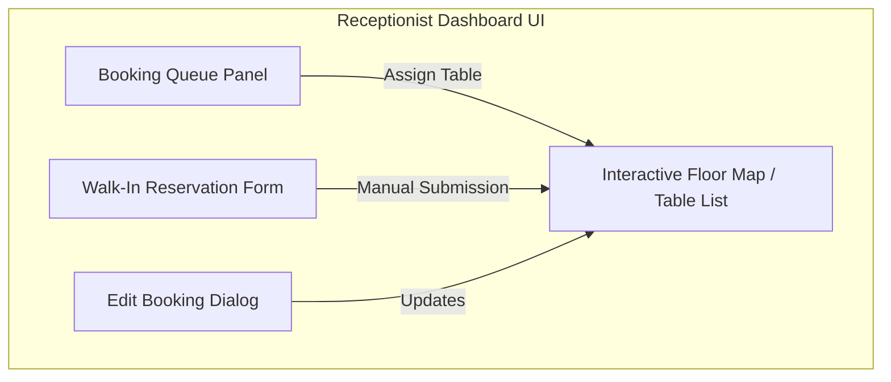

# WhatsApp Interface vs. Receptionist Dashboard

This document details the distinct roles, screens, user flows, and data interactions between the customer-facing **WhatsApp Conversational Interface** and the admin-facing **Receptionist Dashboard**.

---

## 1. WhatsApp Interface (Customer-Facing)

The WhatsApp channel is designed for natural, low-friction interactions. It is powered by a conversational AI agent and structured message buttons (interactive components).

### Key Workflows & Messages:

### Screen & Message Mapping:
* **Welcome Menu:** A persistent menu or list selector offering:
  1. 🍽️ Dine In (Reserve / Order Now)
  2. 🛍️ Take Away
  3. 🛵 Delivery
  4. 📖 Browse Menu
* **Reservation Details Inputs:** Text prompts or list pickers for:
  * Name (if new customer)
  * Party size (number button array)
  * Date/Time selection
* **Live Notifications:**
  * *Queue Notification:* *"We are checking table availability. Hang tight!"*
  * *Confirmation Notification:* *"Your table is confirmed! Table [ID] at [Time]."*
  * *Edit Notification:* *"Notice: Your reservation details have been updated. New Time: [Time], Table: [Table ID]."*
* **Conversational Ordering Interface:**
  * Direct AI searching: *"Show me gluten-free options under ₹400"*
  * Add-to-cart replies: *"Add 2 Paneer Tikka"*
  * Cart review & interactive payment links.

---

## 2. Receptionist Dashboard (Admin-Facing)

The dashboard is a real-time web application (e.g. React/Vue SPA) used by the restaurant staff to orchestrate floor bookings, walk-ins, and incoming WhatsApp requests.

### Key Screens & Features:

### Detailed Feature Specification:

#### A. Real-Time Reservation Queue
A list view sorted chronologically (latest requests first or closest booking time first).
* **Information Displayed:**
  * Customer Name & Phone Number
  * Booking Source (WhatsApp Icon vs. Manual Walk-In Icon)
  * Party Size & Requested Date/Time
  * Elapsed Queue Time (e.g. "Pending for 4 mins")
  * Status Badge (`Pending`, `Confirmed`, `Seated`, `Cancelled`)
* **Quick Actions:**
  * **Assign Table (Dropdown/Modal):** Shows a list of currently available tables matching the party size.
  * **Edit:** Opens a modal to modify booking details.
  * **Reject/Cancel:** Cancels request and prompts for a cancellation reason (sent to customer via WhatsApp).

#### B. Walk-In Booking Tool
For guests arriving directly in person without using WhatsApp.
* **Input Fields:**
  * Guest Name
  * Phone Number (optional, but requested for CRM/SMS alerts)
  * Party Size
  * Table Assignment (lists empty tables)
  * Special Requests (e.g., "high chair needed", "birthday")
* **Action:** Submitting immediately marks the reservation as `CONFIRMED` and reserves the table status.

#### C. Edit & Update Interface
Allows modifying any active or pending reservation details:
* **Modifiable Fields:** Party size, date/time, table assignment, or guest notes.
* **Webhook Trigger:** Saving updates triggers a backend job to update the database and push an automated sync message to the customer's WhatsApp thread.

#### D. Visual Table Map (Floor View)
A graphical representation of the restaurant layout showing:
* **Occupied tables** (Red - showing seated time and current order value)
* **Reserved tables** (Yellow - showing reservation time and guest name)
* **Available tables** (Green)

---

## 3. Data Synchronization Matrix

| Feature | WhatsApp Flow (Customer-Facing) | Dashboard Flow (Admin-Facing) | Sync Trigger |
| :--- | :--- | :--- | :--- |
| **New Reservation Request** | Initiates request. Inputs name, date, time, and party size. | Receives push notification. Request appears at the top of the queue. | WhatsApp message webhook ➔ DB Insert ➔ Real-time dashboard push. |
| **Table Confirmation** | Receives confirmation alert showing table number. | Selects table and confirms the reservation. | Receptionist click ➔ DB Update status="CONFIRMED" ➔ Outbound WhatsApp API. |
| **Booking Adjustments (Edits)** | Receives change notification (e.g. *"Time changed to 8:30"*). | Receptionist edits booking parameters in the form and saves. | Receptionist Save ➔ DB Update ➔ Outbound WhatsApp API alert. |
| **Walk-In Creation** | Optional: Receives SMS/WhatsApp confirmation if phone number is provided. | Receptionist registers details directly in the system. | Dashboard Submit ➔ DB Insert status="CONFIRMED" ➔ SMS/WhatsApp trigger. |
| **Table Assignment Release** | Session expires or order completes ➔ Table status resets to green. | Clicks "Release Table" or payment matches order closure. | Order Checkout/Manual Release ➔ Table Status Update. |
